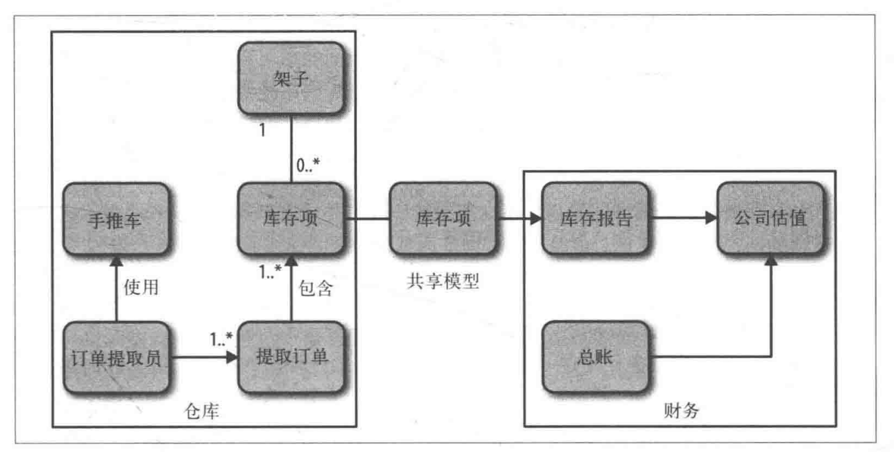
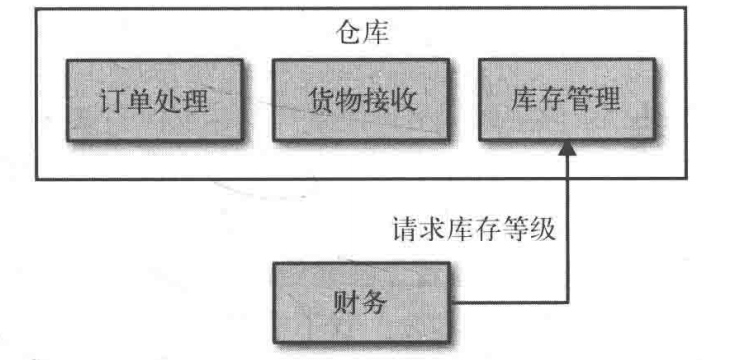
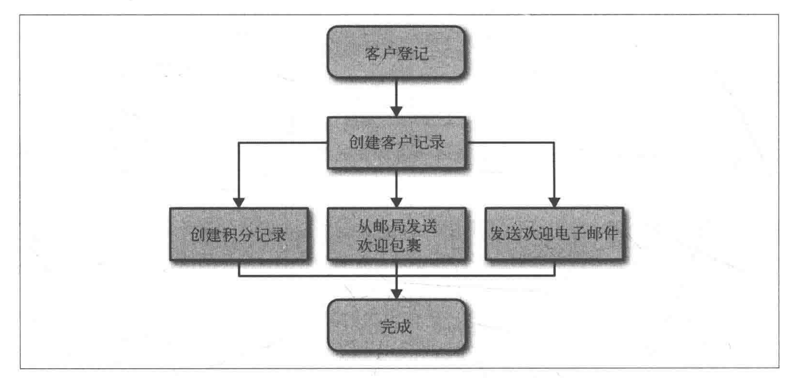
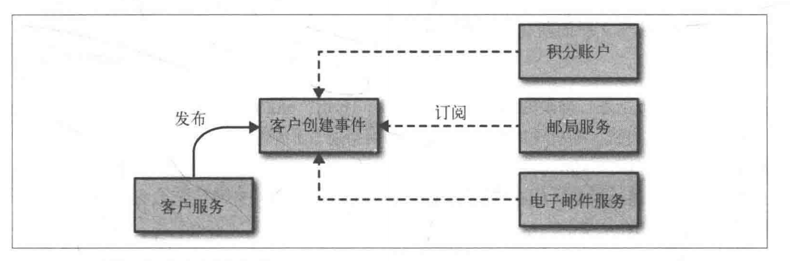

- [微服务](#%E5%BE%AE%E6%9C%8D%E5%8A%A1)
  - [什么是微服务](#%E4%BB%80%E4%B9%88%E6%98%AF%E5%BE%AE%E6%9C%8D%E5%8A%A1)
  - [内聚性](#%E5%86%85%E8%81%9A%E6%80%A7)
  - [代码库多小算小](#%E4%BB%A3%E7%A0%81%E5%BA%93%E5%A4%9A%E5%B0%8F%E7%AE%97%E5%B0%8F)
  - [自治性](#%E8%87%AA%E6%B2%BB%E6%80%A7)
  - [主要好处](#%E4%B8%BB%E8%A6%81%E5%A5%BD%E5%A4%84)
  - [SOA（面向服务的架构）](#SOA%E9%9D%A2%E5%90%91%E6%9C%8D%E5%8A%A1%E7%9A%84%E6%9E%B6%E6%9E%84)
    - [共享库](#%E5%85%B1%E4%BA%AB%E5%BA%93)
      - [优点](#%E4%BC%98%E7%82%B9)
      - [缺点](#%E7%BC%BA%E7%82%B9)
    - [模块](#%E6%A8%A1%E5%9D%97)
      - [OSGI（开放服务网关协议）--Java](#OSGI%E5%BC%80%E6%94%BE%E6%9C%8D%E5%8A%A1%E7%BD%91%E5%85%B3%E5%8D%8F%E8%AE%AE--Java)
      - [Erlang](#Erlang)
      - [优缺点](#%E4%BC%98%E7%BC%BA%E7%82%B9)
  - [没有银弹](#%E6%B2%A1%E6%9C%89%E9%93%B6%E5%BC%B9)
- [如何建模服务](#%E5%A6%82%E4%BD%95%E5%BB%BA%E6%A8%A1%E6%9C%8D%E5%8A%A1)
  - [松耦合](#%E6%9D%BE%E8%80%A6%E5%90%88)
  - [高内聚](#%E9%AB%98%E5%86%85%E8%81%9A)
  - [限界上下文](#%E9%99%90%E7%95%8C%E4%B8%8A%E4%B8%8B%E6%96%87)
  - [MusicCrop的业务领域](#MusicCrop%E7%9A%84%E4%B8%9A%E5%8A%A1%E9%A2%86%E5%9F%9F)
  - [模块和服务](#%E6%A8%A1%E5%9D%97%E5%92%8C%E6%9C%8D%E5%8A%A1)
  - [过早划分](#%E8%BF%87%E6%97%A9%E5%88%92%E5%88%86)
  - [划分误区](#%E5%88%92%E5%88%86%E8%AF%AF%E5%8C%BA)
  - [逐步划分上下文（服务细分）](#%E9%80%90%E6%AD%A5%E5%88%92%E5%88%86%E4%B8%8A%E4%B8%8B%E6%96%87%E6%9C%8D%E5%8A%A1%E7%BB%86%E5%88%86)
- [集成](#%E9%9B%86%E6%88%90)
  - [集成时注意点](#%E9%9B%86%E6%88%90%E6%97%B6%E6%B3%A8%E6%84%8F%E7%82%B9)
  - [集成方式](#%E9%9B%86%E6%88%90%E6%96%B9%E5%BC%8F)
    - [共享数据库](#%E5%85%B1%E4%BA%AB%E6%95%B0%E6%8D%AE%E5%BA%93)
    - [同步与异步](#%E5%90%8C%E6%AD%A5%E4%B8%8E%E5%BC%82%E6%AD%A5)
    - [编排与协同](#%E7%BC%96%E6%8E%92%E4%B8%8E%E5%8D%8F%E5%90%8C)
    - [远程过程调用](#%E8%BF%9C%E7%A8%8B%E8%BF%87%E7%A8%8B%E8%B0%83%E7%94%A8)
    - [REST](#REST)
      - [REST与HTTP](#REST%E4%B8%8EHTTP)
      - [超媒体作为程序状态引擎（HATEOAS）](#%E8%B6%85%E5%AA%92%E4%BD%93%E4%BD%9C%E4%B8%BA%E7%A8%8B%E5%BA%8F%E7%8A%B6%E6%80%81%E5%BC%95%E6%93%8EHATEOAS)
# 微服务
## 什么是微服务
微服务就是一些协同工作小而自治的服务。

## 内聚性
在单块系统中，通常会创建一些抽象层或者模块来保证内聚性。（单一职责原则：把因相同的原因而变化的东西聚合一起，而把因不同原因而变化的东西分离开来）

微服务将该理念应用在独立的服务商。

## 代码库多小算小
- 一个微服务应该可以在两周内完全重写————Jon Eaves
- 你不再觉得你代码库过大，可能它就足够小了
- 该服务是否能够很好地与团队结构相匹配。如果代码库过大，一个小团队无法正常维护，那么很显然应该将其拆成小的

服务越小的优点和缺点也越明显。越小，独立性带来的发布管理越复杂。

## 自治性
服务之间通过网络进行通信，通过暴露API来进行通信，API实现方式应该与具体技术无关。
- 判断服务是否很好解耦的黄金法则  
  **是否能够修改一个服务并对其进行部署，而不影响任何服务。**
## 主要好处
- 技术异构性。比如现在有一功能使用其他技术能够使某个业务效率更好，如果单体模式下，对整个系统会产生巨大影响，而微服务就不会，可以选择风险最小的服务采用新技术。
- 弹性。服务的边界就是一个很显然的舱壁。单块服务系统中，服务不可用，所有功能都不可用。使用微服务可以恨到处理服务不可用和功能降级。
- 方便扩展。单体系统如果要扩展只能扩展整体。而微服务的扩展就方便了很多。
- 简化部署。如果是单体系统，修改一行代码带来的影响很大，风险很大，这样导致更新频率低，最后发布出来的时候两次发布之间的差异很大，差异越大，出错可能性越大。在微服务中，如果出现问题，也只是影响一个服务，并且可以快速回滚。
- 与开发组织结构相匹配。避免出现过大代码库，从而获得理想的团队大小和生产力，避免异地团队出现。
- 可组合性。现在除了PC，还有Web、原生应用、移动端等等平台，通过各个服务的拼接和复用可以避免很多代码的重复。
- 对替代性的优化。有的遗留系统大而且旧，所能支持的硬件是二十几年前的，但是取代这样的代码工作量大风险高。如果是微服务对于这种替换的操作就很容易

## SOA（面向服务的架构）
是一种设计方法，其中包含多个服务，而服务之 间通过配合最终提供一系列功能。  
- 实施SOA的时候会遇到一些问题：  
  通信协议（如SOAP）如何选择，第三方中间件如何选择，服务粒度如何确定等  
- 现有的SOA并不能帮助你把很大的应用划分小。它没有提到多大算大，也没有讨论如何在显示世界中有效防止服务之间的过度耦合。
- **微服务是SOA的一种特定方法**
##其他分解技术
### 共享库
就是代码分解成多个库
#### 优点
- 团队和服务通过库共享功能
- 库可以重用
#### 缺点
- 技术无法异构。
- 不方便扩展。
- 部署不方便。除非用动态链接库，否则每次都需要重新部署整个进程。
- 弹性差。没有明显接缝来建立架构安全，无法确保系统弹性。

### 模块
允许对模块进行生命周期管理，可以把模块部署到运行的进程中，并且可以不停止整个进程的前提对某个模块进行修改。

#### OSGI（开放服务网关协议）--Java
Java本身并不支持模块概念。复杂度远远大于其带来的好处

#### Erlang
很成熟，语言本身支持模块。支持同时运行同一个模块的多个版本，从而可以优雅的模块升级。对模块可以停止、重启、升级等操作。

#### 优缺点
还是和共享库一样。但是其部署可能方便一些。

## 没有银弹
不是万能药，需要面对所有分布式系统的复杂性，在部署，测试，监控等方面需要做很多工作。还需要处理类似分布式事务和CAP相关问题。

# 如何建模服务
以一个专辑电商MusicCorp为例  
- 一个赢得世界的方法：保证自己很容易对应用进行修改。  
- 需要专注于：松耦合，高内聚

## 松耦合
如果修改一个服务不需要修改另一个服务，那么就做到了服务之间的松耦合。  
一个松耦合的服务应该 **尽可能少** 地知道与之协作的那些服务的信息。也就是说限制服务之间调用形式的数量。

## 高内聚
把相关的聚集在一起，不相关放在别处。  
- 好处
  - 修改的时候只需要修改一处
  - 修改后可以尽快发布
## 限界上下文
(推荐：Eric Evans《领域驱动设计》)
- 定义：
  - 一个显示边界限定的特定职责。
  - 就像是细胞膜，定义什么在细胞内，什么在细胞外，并且规定了什么无知可以通过细胞膜。
  - 限界上下文中的东西分为两部分，一部分不需要与外部通信，另一部分则需要。

## MusicCrop的业务领域
  
详见3.3.1
  
- 许多数据模型对内对外有两种表示方式。
- 同一个名字在不同的上下文有着完全不同的含义。比如退货对于客户和仓库来说是完全不同的含义意味，需要不同的操作。

## 模块和服务
- 可以现在在单块系统中根据内部的限界上下文，使用模块同事使用共享(对外)和隐藏模型(对内)进行建模。  
- 然后通过模块的边界，可以使其成为微服务边界的候选。一般，微服务应该清晰地和限界上下问保持一致。  
- 在熟练了之后可以省去现在单块系统中使用模块这个步骤。
- 如果边界弄错后面修复的代价很大，所以最好先等系统稳定了之后，在将模块划分出去成为微服务。

## 过早划分
 过早的将一个系统划分为微服务的代价非常高，尤其在面对新领域的时候。很多时候将已有的代码划分为微服务要比从头开始构建微服务简单许多。

## 划分误区
应该从上下文来考虑微服务，而不应该简简单单把数据库操作集合成一个模块。  
仓库可能需要库存清单，财务可能需要月末账目，这些都是基于数据库的CRUD。为了实现这些可能需要存储信息的模型，但是不能简简单单的基于CRUD来划分服务，这样会导致模型贫血。

## 逐步划分上下文（服务细分）
一开始粗粒度划分，当发现合适缝隙后，再进一步划分出哪些嵌套的上下文。比如仓库可以前考订单处理，库存管理，货物接受这些上下文。
- 方法
  - 嵌套的上下文对外界不可见，发出的请求被透明地映射到两个或者更多的服务上，呈现嵌套式。  
  
  - 嵌套的上下文对外界可见。服务都是顶层微服务。  
    

如果不同子服务是不同团队维护的，那么可能会比较希望都是顶层微服务。  
如果都是一个团队，嵌套是可能更好，因为**组织结构和软件架构会互相影响**(第十章详述)。另一点就是使得架构更加成块可以更好的测试。比如，测试仓库的消费方服务时，不需要对仓库上下文中的每个服务进行**打桩**，只需要专注与粗粒度的API即可。当考虑更大范围的测试的时候，也能给你一定的单元隔离，比如我可以有这样的一种端到端测试，该测试会使用仓库上下文中的所有服务，但其他的所有协作者可以做打桩处理。(第七章详述)

# 集成
如何将多个服务继承为一体，现阶段有许多实现方式，SOAP，XML-RPC，REST，Protocol Buffer等等，在此之前我们需要考虑，到底希望从这些数据中得到什么。
## 集成时注意点
- 避免破坏性修改  
避免服务的修改导致消费方的修改，比如一个响应中添加一个字段，已有消费方不应该受到影响。

- 保证API的技术无关性  
  保证微服务之间通信方式的技术无关性很重要，因为IT行业变化很快。

- 使你的服务易于消费方使用  
  理想情况下，消费方可以使用任何技术来实现。  
  也可以提供客户端库，但是这样会带来一些耦合。

- 隐藏内部实现细节
  如果被消费方依赖服务细节，那么如果细节变化，就会使消费者跟着调整，而这是我们想要避免的。

## 集成方式
### 共享数据库

**缺点：**
- 外部系统能够查看内部实现细节，并与其绑定在一起。
- 如果决定更好的表示数据或者增加可维护性而修改表结构的话，消费放就无法进行工作。比如帮助台如何管理客户，这就需要修改数据库。为了不影响其他服务，必须小心修改与其他服务相关的表结构，然后对相关的服务做回归测试。
> 回归测试是指修改了旧代码后，重新进行测试以确认修改没有引入新的错误或导致其他代码产生错误。自动回归测试将大幅降低系统测试、维护升级等阶段的成本。  
> 回归测试作为软件生命周期的一个组成部分，在整个软件测试过程中占有很大的工作量比重，软件开发的各个阶段都会进行多次回归测试。在渐进和快速迭代开发中，新版本的连续发布使回归测试进行的更加频繁，而在极端编程方法中，更是要求每天都进行若干次回归测试。因此，通过选择正确的回归测试策略来改进回归测试的效率和有效性是很有意义的。

- 消费方与特定的技术绑定在一起。如果想把关系型数据库换成非关系型，这样很难替换数据库。可见隐藏实现细节(暴露了使用mysql)非常重要，因为其让我们的服务有一定自治性，可以轻易地修改其内部实现。破坏松耦合。

- 肯定有一部分逻辑负责对客户进行修改。如果消费方直接操作数据库，它们需要对这些逻辑负责。对数据库进行操作的相似逻辑可能会出现在很多服务中。修复一个bug可能要修改多个地方，破坏内聚性。
  

### 同步与异步
- 如果使用同步通信，发起一个远程服务调用后，调用方会阻塞自己并等待整个操作的完成。如果使用异步通信，调用方不需要等待操作完成就可以返回，甚至可能不需要关心这个操作完成与否。  
- 同步可以知道事情成功与否，异步效率比较高，且相对复杂。  
- 有着各自的协作风格，即请求/响应或者基于事件。

### 编排与协同

当考虑具体实现时，有两种架构风格可以采用，即编排和协同。  
使用**编排(orchestration)** 的话，我们会依赖于某个中心大脑来指导并驱动整个流程，就像管弦乐队中的指挥一样。  
使用**协同(choreography)**的话，我们仅仅会告知系统中各个部分各自的职责，而把具体怎么做的细节留给它们自己，就像芭蕾舞中每个舞者都有自己的方式，同时也会响应周围其他人。

---

**例子：**  
MusicCorp中创建用户时发生了什么：
1. 在客户的积分账户中创建一条记录
2. 通过邮政系统发送一个欢迎礼包
3. 向客户发送欢迎电子邮件

- 如果使用编排  
  最简单的就是客户服务作为中心大脑，如果使用的是同步的请求/响应模式，甚至能知道每一步是否都成功。缺点是中心控制点承担太多职责。
  
- 如果使用协同  
  可以仅仅从客户服务中使用异步的方式触发一个事件，该事件名为“客户创建”。优点是显著消除耦合，缺点是看不到明显的业务流程图。需要一些额外的工作来监控流程，保证正确进行。比如，如果几分账户存在的bug导致账户没有创建成功，程序是否能够捕捉这个问题。  
  一般重量级编排的编排非常不稳定且代价高，所以更倾向协同。
  
- 如果想要请求/响应风格的语义，又想避免其在耗时业务上的困境，可以**采用异步请求加回调方式**。

### 远程过程调用
RPC允许进行一个本地调用，但事实上结构是由某个远程服务器产生的。

**RPC技术**：
- Java RMI：要求相同的技术栈，带来紧耦合。
- Thrift
- protocol buffers
- SOAP

**优点**：
- RPC的实现可以生成服务端和客户端的桩代码，从而让你快速开始编码。
- ...

**缺点**：
- 随着使用慢慢暴露一些问题。
- 技术的耦合。如RMI，客户端和服务器都一定要JVM
- 本地调用和远程调用并不相同。**RPC的核心想法是隐藏远程调用的复杂性**，但是很多RPC的实现隐藏过头，程序员很容易将其当作本地调用来用，RPC会花大量时间对负荷进行封装和解封装。
- 而且网络也会有延迟且不可靠。
- 脆弱性。如果服务端对远程函数规格说明（如添加一个创建用户的远程函数）进行修改，客户端都需要重新生成桩。如果删除了原本远程函数的某个形参，那么客户端和服务端都需要为了应用这些修改重新部署。

**RPC真的很糟糕？**
- 不要对远程调用过度抽象，以至于网络因素完全被隐藏。
- 在客户端不要隐藏我们是在做网络调用这个事实。
- 不要使用RMI。

### REST

#### REST与HTTP
REST架构声明了一组对所有资源的标准方法，而HTTP恰好也定义了一组方法可供使用。而且HTTP也自带了许多功能和其HTTP生态带来的工具也给REST架构的实现带来便利。

#### 超媒体作为程序状态引擎（HATEOAS）
客户端应该与服务端通过哪些指向其他资源的链接进行交互，而这些交互有可能造成状态转移。如不需要Customer在服务端的URI，客户端根据链接导航到它想要的东西。（注：就像一个超链接）