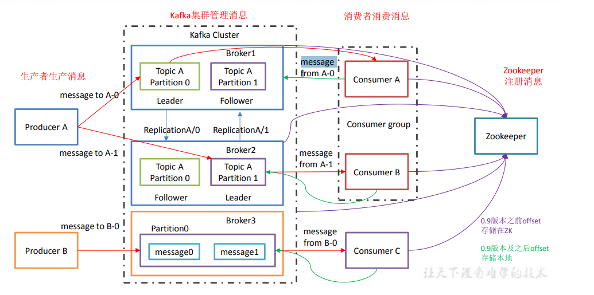

> 尚硅谷:https://www.bilibili.com/video/av65544753

# 使用消息队列的好处
1. 解耦
2. 可恢复性
3. 缓冲
4. 灵活性和峰值处理能力  
   - 在访问量剧增的情况下，应用仍然需要继续发挥作用，但是这样的突发流量并不常见。
   - 如果为以能处理这类峰值访问为标准来投入资源随时待命无疑是巨大的浪费。使用消息队列
能够使关键组件顶住突发的访问压力，而不会因为突发的超负荷的请求而完全崩溃。
5. 异步通信

# 消息队列两种模式
1. 点对点
2. 发布/订阅模式
   1. 中间件推
      - 缺点：可能消费者能力不足，崩了
   2. 消费者拉
      - 缺点：浪费资源，比如需要消费者不断监听
  
# Kafka基础架构

- Producer ：消息生产者，就是向 kafka broker 发消息的客户端；
- Consumer ：消息消费者，向 kafka broker 取消息的客户端；
- Consumer Group （CG）：消费者组，由多个 consumer 组成。`消费者组内每个消费者负责消费不同分区的数据，一个分区只能由一个组内消费者消费；消费者组之间互不影响。`所有的消费者都属于某个消费者组，即`消费者组是逻辑上的一个订阅者`。
- Broker ：一台 kafka 服务器就是一个 broker。一个集群由多个 broker 组成。一个 broker可以容纳多个 topic。
- Topic ：可以理解为一个队列，`生产者和消费者面向的都是一个 topic`；
- Partition：为了实现扩展性，一个非常大的 topic 可以分布到多个 broker（即服务器）上，`一个 topic 可以分为多个 partition`，每个 partition 是一个有序的队列；
- Replication：副本，为保证集群中的某个节点发生故障时，`该节点上的 partition 数据不丢失，且 kafka 仍然能够继续工作`，kafka 提供了副本机制，一个 topic 的每个分区都有若干个副本，一个 leader 和若干个 follower。
- leader：每个分区多个副本的“主”，生产者发送数据的对象，以及消费者消费数据的对象都是 leader。
- follower：每个分区多个副本中的“从”，实时从 leader 中同步数据，保持和 leader 数据的同步。leader 发生故障时，某个 follower 会成为新的 follower。


- 每一个分区只能被同一个消费者组里的一个消费者消费。消费者组里的消费者个数和主题的分区数一样时，并发度最好

- kafka能正常运行要依赖zookeeper，想把多个kafka组起来很容易，只要用的zookeeper是同一个集群

- 消费者也要保存消费的位置信息到哪了，不然有10条运行到5条挂了会找不到，所以这些信息也会保存在zookeeper。当然内存里面自己也有一份，平时运行的时候使用，zookeeper只是用在挂掉了的时候。0.9之前offset存放在zk版本，0.9之后存在kafka，存到一个系统的topic由系统维护

- 为什么要改呢？  
  消费者本身和消费者集群是连接的，和kafka连接还得维护和zk的连接，消费者以拉取方式，高效率，如果和zk打交道的话可能效率不匹配，zk本身就是提高各大框架润滑剂的作用

- kafka的消息存在磁盘，默认存放7天

# 安装,配置和分发
## 安装
直接官网下载解压完事

## 修改配置文件

```sh
#broker 的全局唯一编号，不能重复
broker.id=0
#删除 topic 功能使能
delete.topic.enable=true
#处理网络请求的线程数量
num.network.threads=3
#用来处理磁盘 IO 的现成数量
num.io.threads=8
#发送套接字的缓冲区大小
socket.send.buffer.bytes=102400
#接收套接字的缓冲区大小
socket.receive.buffer.bytes=102400
#请求套接字的缓冲区大小
socket.request.max.bytes=104857600
#kafka 运行日志存放的路径
log.dirs=/opt/module/kafka/logs
#topic 在当前 broker 上的分区个数
num.partitions=1
#用来恢复和清理 data 下数据的线程数量
num.recovery.threads.per.data.dir=1
#segment 文件保留的最长时间，超时将被删除
log.retention.hours=168
#配置连接 Zookeeper 集群地址
zookeeper.connect=hadoop102:2181,hadoop103:2181,hadoop104:2181
```
## 分发安装包
把这个包分给其他服务器  
[atguigu@hadoop102 module]$ xsync kafka/
## 群启动

```sh
for i in hadoop102 hadoop103 hadoop104
do
echo "========== $i =========="
ssh $i '/opt/module/kafka/bin/kafka-server-start.sh -daemon
/opt/module/kafka/config/server.properties'
done
```


#


server.log  比较重要，如果运行后看不到kafka可以在这里查原因


logs目录会自己创建


producer.properties

server.properties

zookeeper.properties

jps xcall.sh


