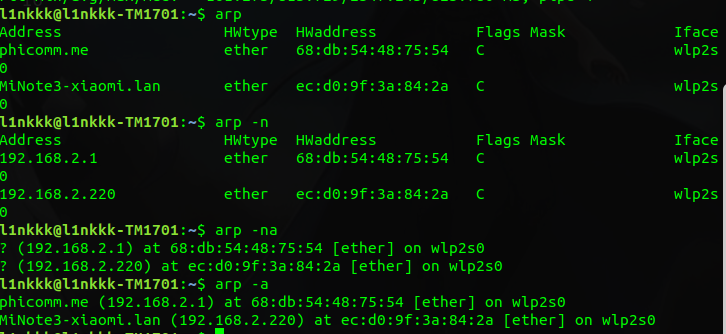
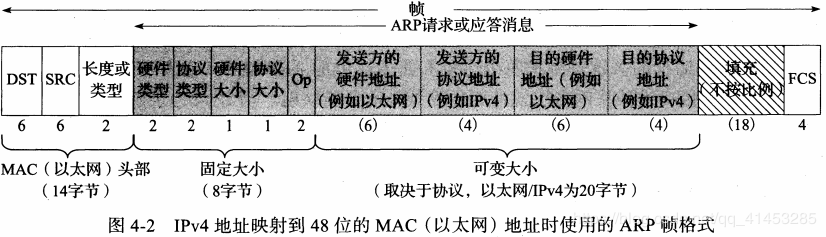
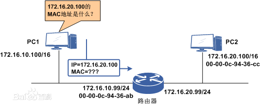

# 引言
ARP是一个通用的协议，从一般性看，它被设计为支持多种地址之间的映射，而不止MAC和IP地址。实际上，ARP几乎用于32位的ipv4和MAC地址之间的映射。 
ARP的反向映射协议**RARP**，很少使用，主要用于缺少磁盘驱动器(通常是 无盘工作站 或 X终端)【tag:l1nkkk-待查】的系统。 

------------
# 基本

ARP仅使用在广播网络，链路层能将消息交付到发送者同一个VLAN的所有主机；**如果在非广播网络**，需要更复杂的映射地址。 
**仅用于ipv4**,ipv6使用**邻居发现协议**,它被合并到ICMP6  
**同一广播域中的所有系统可接收ARP请求**，这包括可能根本不运行ipv4和ipv6协议的系统，但不包括位于不同Vlan中的系统。 

# ARP缓存

 
在linux中可以使用arp命令来查看arp表。 
-a表示列出所有。  
-n表示不要用主机名代替IP。  
各项代表的意义见书p116  
**需要特别注意Flags Mask**Flags Mask表标志包含一个符号C,M,P;  
                                                                                                                                                                                                                                            
| 符号 | 含义                                                             |
| ---- | ---------------------------------------------------------------- |
| C    | 动态学习得到的                                                   |
| M    | 手工静态输入的(arp -s)                                           |
| P    | 含义为”发布“，主机会对该IP的ARP请求做出响应，**用于设置ARP代理** |
  
* 通常系统收到发送给他的ARP请求之后,还会把对方的IP和硬件地址记录
* ARP请求的重发频率大概每秒一次。
* 如果ARP请求一个不存在的IP的话，那么会在ARP表中生成一个**不完整条目(incomplete)**

# ARP帧
  
* 可以发现有一些重复的信息--发送方的硬件地址
* ARP应答和请求的大小都是42字节，每个帧均填充为最小以太网帧，60字节数据和4字节CRC。

# 缓存超时
* 大多数实现中，完整条目超时为20分钟，不完整条目超时为3分钟
* 这些实现通常在每次使用后重新启动20分钟的超时
* 软状态：指在超时到达前如果都没有使用过就会被丢弃。
# ARP代理
* ARP代理并不常见，通常应该尽量避免使用
* ARP代理的历史用途：两个物理网络使用相同的IP前缀但是相互隐蔽。这种情况下ARP广播包进不了另外一个网络，可以将路由器设置成ARP代理，将自己的IP和MAC作为ARP响应 
* LINUX支持自动代理ARP的功能，这样就不必每个IPv4都手动使用arp -s加入，这样可以代理一个地址范围。 
>代理ARP的工作过程如下：  
>PC1和PC2虽然属于不同的广播域，但它们处于同一网段中，因此PC1会向PC2发出ARP请求广播包，请求获得PC2的MAC地址。由于路由器不会转发广播包，因此ARP请求只能到达路由器，不能到达PC2。  
>当在路由器上启用ARP代理后，路由器会查看ARP请求，发现IP地址172.16.20.100属于它连接的另一个网络，因此路由器用自己的接口MAC地址代替PC2的MAC地址，向PC1发送了一个ARP应答。  
PC1收到ARP应答后，会认为PC2的MAC地址就是00-00-0c-94-36-ab，不会感知到ARP代理的存在。

+  使用ARP代理有两个常见的原因：
1. 有些系统无法进行子网划分，其以为另外一个子网还是在本广播域中，所以使用了广播ARP，但其实并不是同一个广播域，这个时候路由器代理ARP让其透明
2. 有些系统使用比较旧的广播地址，如全0的主机ID而不是全1，这导致无法接收到ARP广播包。

